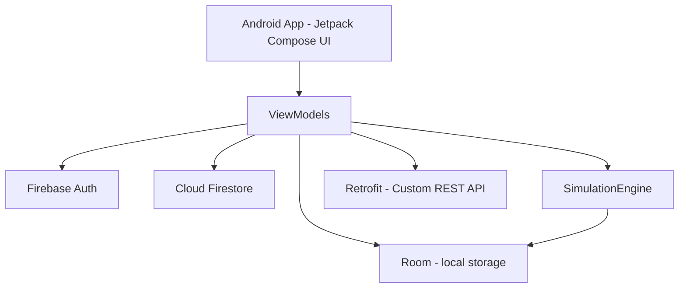
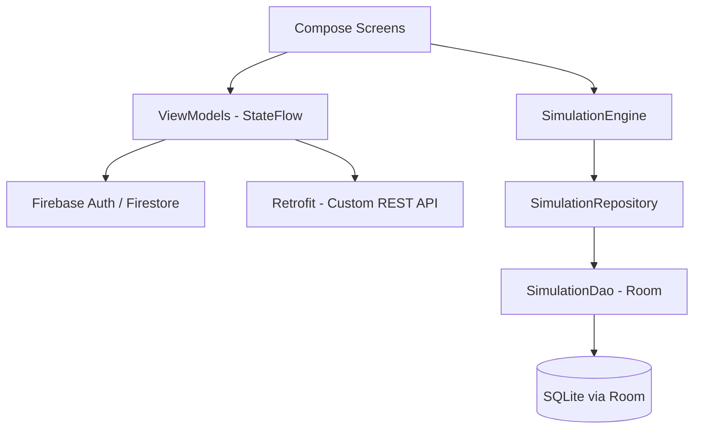
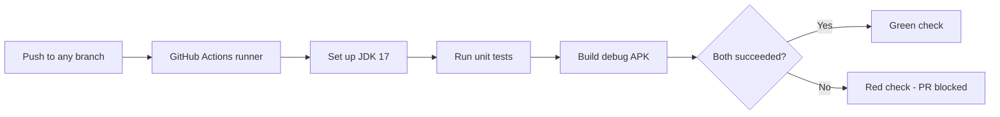

# What-If Portfolio Simulator

Android app for PROG7314 / OPSC7312 Part 2 — a portfolio "what-if" simulator that projects how an investment grows over time, both in nominal terms and adjusted for inflation (CPI).

## Overview

The app lets a signed-in user enter a starting investment, a monthly contribution, an expected annual return, and an expected annual inflation rate, then generates a year-by-year projection of the portfolio's value. Two figures are shown side by side: the **nominal value** (what the account balance will actually read) and the **real value** (what that balance is worth once inflation is accounted for). The idea is to make the gap between "what your statement says" and "what you can actually buy with it" visible, rather than a single optimistic number.

**Target users:** people planning long-term investments or retirement contributions who want a quick, visual sense of how inflation erodes nominal growth over a chosen time horizon — not a licensed financial-advice tool.

## Features

| Feature | Status | What it does |
|---|---|---|
| Google Sign-In (Firebase Auth) | Implemented | Signs a user in via Credential Manager + Firebase Auth with standard email and password |
| Dashboard | Implemented | Reads the signed-in user's 3 most recently updated simulations from Firestore |
| Settings | Implemented | Display currency and dark-theme toggle, saved locally via DataStore, currency mirrored to Firestore |
| Simulation Builder | Implemented | Enter investment inputs, see a live nominal-vs-real projection, save the result |
| Simulation calculation engine | Implemented | `SimulationEngine` — nominal growth, CPI-adjusted real value, year-by-year breakdown |
| Nominal vs. real value chart | Implemented | `PortfolioCanvasChart` — two-line Canvas chart comparing nominal and CPI-adjusted growth |
| Saved simulations (local) | Implemented | Room database stores simulations on-device; `SavedSimulationsScreen` lists and deletes them |
| Navigation graph | Implemented, not yet wired to the app entry point | See [Known Limitations](#known-limitations) |
| REST API / cloud backend | Fully implemented and deployed, not yet merged into `main` | See [REST API / Backend](#rest-api--backend) |
| Biometric auth, offline sync, push notifications, multi-language | Not yet implemented | POE-only scope, not required for Part 2 |

The three user-defined features built for Part 2 are the **Simulation Builder**, the **nominal-vs-real Canvas chart**, and **local (Room) saved simulations** — all under `data/engine/`, `ui/chart/`, and `data/local/`.

## Technologies Used

Checked directly against `app/build.gradle.kts` and the root `build.gradle.kts` — nothing below is assumed.

| Technology | Purpose |
|---|---|
| Kotlin 2.0.21 | Application language |
| Jetpack Compose (BOM 2024.09.00) | UI |
| Android Gradle Plugin 8.7.3 | Build tooling |
| Firebase Authentication | Google Sign-In |
| Cloud Firestore | Simulation summaries (Dashboard) and user profile/currency mirror |
| Credential Manager + googleid | Google ID token retrieval |
| Jetpack DataStore (Preferences) | Local settings persistence |
| Room 2.6.1 (+ KSP) | Local simulation storage |
| Navigation Compose 2.8.1 | Declared navigation graph |
| Retrofit | Android network layer for the custom REST API |
| Node.js / Express (Vercel) | Custom serverless REST API backend |
| JUnit 4.13.2 | Unit test runner |
| MockK 1.13.13 | Mocking Firebase dependencies in tests |
| kotlinx-coroutines-test | Coroutine/ViewModel test support |
| GitHub Actions | CI — automated build + test on every push |

## System Architecture


What-If Portfolio Simulator
Android app for PROG7314 / OPSC7312 Part 2 — a portfolio "what-if" simulator that projects how an investment grows over time, both in nominal terms and adjusted for inflation (CPI).
Overview
The app lets a signed-in user enter a starting investment, a monthly contribution, an expected annual return, and an expected annual inflation rate, then generates a year-by-year projection of the portfolio's value. Two figures are shown side by side: the nominal value (what the account balance will actually read) and the real value (what that balance is worth once inflation is accounted for). The idea is to make the gap between "what your statement says" and "what you can actually buy with it" visible, rather than a single optimistic number.
Target users: people planning long-term investments or retirement contributions who want a quick, visual sense of how inflation erodes nominal growth over a chosen time horizon — not a licensed financial-advice tool.
Features
Feature	Status	What it does
Google Sign-In (Firebase Auth)	Implemented	Signs a user in via Credential Manager + Firebase Auth
Dashboard	Implemented	Reads the signed-in user's 3 most recently updated simulations from Firestore
Settings	Implemented	Display currency and dark-theme toggle, saved locally via DataStore, currency mirrored to Firestore
Simulation Builder	Implemented	Enter investment inputs, see a live nominal-vs-real projection, save the result
Simulation calculation engine	Implemented	`SimulationEngine` — nominal growth, CPI-adjusted real value, year-by-year breakdown
Nominal vs. real value chart	Implemented	`PortfolioCanvasChart` — two-line Canvas chart comparing nominal and CPI-adjusted growth
Saved simulations (local)	Implemented	Room database stores simulations on-device; `SavedSimulationsScreen` lists and deletes them
Navigation graph	Implemented, not yet wired to the app entry point	See Known Limitations
REST API / cloud backend	Fully implemented and deployed, not yet merged into `main`	See REST API / Backend
Biometric auth, offline sync, push notifications, multi-language	Not yet implemented	POE-only scope, not required for Part 2
The three user-defined features built for Part 2 are the Simulation Builder, the nominal-vs-real Canvas chart, and local (Room) saved simulations — all under `data/engine/`, `ui/chart/`, and `data/local/`.
Technologies Used
Checked directly against `app/build.gradle.kts` and the root `build.gradle.kts` — nothing below is assumed.
Technology	Purpose
Kotlin 2.0.21	Application language
Jetpack Compose (BOM 2024.09.00)	UI
Android Gradle Plugin 8.7.3	Build tooling
Firebase Authentication	Google Sign-In
Cloud Firestore	Simulation summaries (Dashboard) and user profile/currency mirror
Credential Manager + googleid	Google ID token retrieval
Jetpack DataStore (Preferences)	Local settings persistence
Room 2.6.1 (+ KSP)	Local simulation storage
Navigation Compose 2.8.1	Declared navigation graph
Retrofit	Android network layer for the custom REST API
Node.js / Express (Vercel)	Custom serverless REST API backend
JUnit 4.13.2	Unit test runner
MockK 1.13.13	Mocking Firebase dependencies in tests
kotlinx-coroutines-test	Coroutine/ViewModel test support
GitHub Actions	CI — automated build + test on every push
System Architecture




Firebase Auth and Firestore are wired directly into the app on `main`. A custom REST API layer also exists (built and deployed) but is not yet merged into `main` — see [REST API / Backend](#rest-api--backend).

### Android Application Architecture

=======
Firebase Auth and Firestore are wired directly into the app on `main`. A custom REST API layer also exists (built and deployed) but is not yet merged into `main` — see REST API / Backend.
Android Application Architecture




Each screen (`SignInScreen`, `DashboardScreen`, `SettingsScreen`, `SimulationBuilderScreen`) has its own ViewModel exposing a single `StateFlow` of a sealed `UiState`, so a screen is always in exactly one state (Loading / Loaded / Error, etc.) rather than juggling several booleans. This unidirectional-data-flow pattern follows the official Jetpack Compose state guidance.

`SimulationEngine` is a stateless object — it takes plain numeric inputs and returns a `SimulationResult`, with no Android or Firebase dependency, which is what makes it possible to unit test on the JVM.

## Authentication

Sign-in uses Android's Credential Manager API to request a Google ID token, which `SignInViewModel` exchanges for a Firebase session via `FirebaseAuth.signInWithCredential`. `SignInViewModel` only holds the resulting `SignInUiState` (Idle, Loading, Error, Success) — it has no Activity/Context reference itself, which is what makes it possible to unit test without Robolectric or an emulator.

## Settings and Preferences

Settings are edited on the Settings screen and handled by `SettingsViewModel`. Two preferences exist: display currency and a dark-theme toggle. Both are persisted locally via `UserPreferencesRepository`, backed by Jetpack DataStore — this is the source of truth the rest of the app reads from, so preferences keep working offline. Display currency is additionally mirrored to the user's Firestore profile document as a best-effort write (local DataStore still wins if that write fails).

Settings and Sign-In both surface errors as part of their `UiState` rather than one-off Toasts, establishing the same inline-error pattern documented for the Simulation Builder (Deliverable 3, Screen 9), for the rest of the team to reuse.

## Simulation Engine

`SimulationEngine.calculateSimulation()` (`data/engine/SimulationEngine.kt`) takes five inputs — initial investment, monthly contribution, annual return rate, annual inflation rate, and a time horizon in years — and compounds the portfolio monthly:

- Each month, the balance grows by the monthly return rate (annual rate ÷ 12) after adding that month's contribution.
- At the end of each year, a CPI adjustment is applied: the year's nominal balance is divided by `(1 + annual inflation rate) ^ year` to get the real value — what that balance would be worth in today's money.
- Total contributions and total interest earned (nominal value − total contributions) are tracked alongside the balance.
- A `SimulationPoint` is recorded for year 0 (the starting point) through the final year, so the UI can chart the whole trajectory, not just the end result.

This is a forward **projection** based on a user-assumed return rate, distinct from the REST API's historical backtest (see below).

## Data Storage

Saved simulations are stored locally using Room. `SavedSimulationEntity` holds a simulation's inputs (title, initial investment, monthly contribution, return rate, inflation rate, years) alongside its computed final nominal and real values. `SimulationDao` provides insert, delete, and query-all operations, and `SimulationRepository` is a thin wrapper around the DAO that the Compose screens use. This is on-device only — there is no cloud sync of saved simulations yet.

## REST API / Backend

A custom serverless REST API (Node.js/Express, hosted on Vercel) exists on a separate branch and is fully built, tested, and deployed — but **not yet merged into `main`**. The app on `main` currently talks to Firebase Auth and Firestore directly rather than through this API. This section will be updated once that branch is merged.

The live API is already deployed at `https://whatif-api.vercel.app` — no redeploy is needed to try it.

### Running the backend locally


Each screen (`SignInScreen`, `DashboardScreen`, `SettingsScreen`, `SimulationBuilderScreen`) has its own ViewModel exposing a single `StateFlow` of a sealed `UiState`, so a screen is always in exactly one state (Loading / Loaded / Error, etc.) rather than juggling several booleans. This unidirectional-data-flow pattern follows the official Jetpack Compose state guidance.
`SimulationEngine` is a stateless object — it takes plain numeric inputs and returns a `SimulationResult`, with no Android or Firebase dependency, which is what makes it possible to unit test on the JVM.
Authentication
Sign-in uses Android's Credential Manager API to request a Google ID token, which `SignInViewModel` exchanges for a Firebase session via `FirebaseAuth.signInWithCredential`. `SignInViewModel` only holds the resulting `SignInUiState` (Idle, Loading, Error, Success) — it has no Activity/Context reference itself, which is what makes it possible to unit test without Robolectric or an emulator.
Settings and Preferences
Settings are edited on the Settings screen and handled by `SettingsViewModel`. Two preferences exist: display currency and a dark-theme toggle. Both are persisted locally via `UserPreferencesRepository`, backed by Jetpack DataStore — this is the source of truth the rest of the app reads from, so preferences keep working offline. Display currency is additionally mirrored to the user's Firestore profile document as a best-effort write (local DataStore still wins if that write fails).
Settings and Sign-In both surface errors as part of their `UiState` rather than one-off Toasts, establishing the same inline-error pattern documented for the Simulation Builder (Deliverable 3, Screen 9), for the rest of the team to reuse.
Simulation Engine
`SimulationEngine.calculateSimulation()` (`data/engine/SimulationEngine.kt`) takes five inputs — initial investment, monthly contribution, annual return rate, annual inflation rate, and a time horizon in years — and compounds the portfolio monthly:
Each month, the balance grows by the monthly return rate (annual rate ÷ 12) after adding that month's contribution.
At the end of each year, a CPI adjustment is applied: the year's nominal balance is divided by `(1 + annual inflation rate) ^ year` to get the real value — what that balance would be worth in today's money.
Total contributions and total interest earned (nominal value − total contributions) are tracked alongside the balance.
A `SimulationPoint` is recorded for year 0 (the starting point) through the final year, so the UI can chart the whole trajectory, not just the end result.
This is a forward projection based on a user-assumed return rate, distinct from the REST API's historical backtest (see below).
Data Storage
Saved simulations are stored locally using Room. `SavedSimulationEntity` holds a simulation's inputs (title, initial investment, monthly contribution, return rate, inflation rate, years) alongside its computed final nominal and real values. `SimulationDao` provides insert, delete, and query-all operations, and `SimulationRepository` is a thin wrapper around the DAO that the Compose screens use. This is on-device only — there is no cloud sync of saved simulations yet.
REST API / Backend
A custom serverless REST API (Node.js/Express, hosted on Vercel) exists on a separate branch and is fully built, tested, and deployed — but not yet merged into `main`. The app on `main` currently talks to Firebase Auth and Firestore directly rather than through this API. This section will be updated once that branch is merged.
The live API is already deployed at `https://whatif-api.vercel.app` — no redeploy is needed to try it.
Running the backend locally

```bash
cd backend
npm install
```


Create `.env.local` with `FIREBASE_SERVICE_ACCOUNT_JSON`, `ALPHA_VANTAGE_KEY`, and `COINGECKO_API_KEY` (see Firebase Console → Project settings → Service accounts to generate the first one).

```bash
node --env-file=.env.local local.js   # serves on http://localhost:3000
```

Deploy with `vercel --prod` from the `backend` folder (requires a Vercel account linked via `vercel login`).

### API Reference

| Method | Endpoint | Auth | Description |
|---|---|---|---|
| GET | `/v1/health` | No | Service health check |
| GET | `/v1/whoami` | Yes | Verifies the caller's Firebase ID token |
| GET | `/v1/cpi` | No | South African CPI index (Stats SA, Dec 2024 = 100 base) |
| GET | `/v1/assets/search` | No | Searches stocks (Alpha Vantage) and/or crypto (CoinGecko) |
| GET | `/v1/assets/:symbol/history` | No | Historical prices, cached in Firestore after first fetch |
| POST | `/v1/simulations` | Yes | Runs a DCA backtest against real historical prices and CPI |
| GET | `/v1/simulations` | Yes | Lists the signed-in user's saved simulations |
| GET | `/v1/simulations/:id` | Yes | Retrieves one simulation |
| PUT | `/v1/simulations/:id` | Yes | Updates a simulation's name or status |
| DELETE | `/v1/simulations/:id` | Yes | Deletes a simulation |

### What's real vs. known limitations

| Piece | Status |
|---|---|
| All 10 endpoints above | Fully implemented, tested locally and against the live deployment |
| Firebase Auth verification | Fully implemented — every protected route checks a real ID token via the Admin SDK |
| Historical price caching | Fully implemented — Firestore `priceHistory` collection, populated on first request per symbol |
| Equity daily history | Limited to the most recent ~100 trading days (Alpha Vantage free-tier restriction); weekly/monthly intervals return full history and are used for longer simulations |
| Crypto history | Limited to the past 365 days (CoinGecko free-tier restriction) |
| Android integration | Fully implemented — `data/remote/` (Retrofit), `RemoteSimulationRepository`; Dashboard fetches via `GET /v1/simulations` |

### Design notes

- **Hosting change from Part 1:** the original design specified Firebase Cloud Functions, which requires Firebase's paid Blaze plan — unavailable to the team — so the same Express API is hosted on Vercel's free tier instead. Firebase Authentication and Firestore are unchanged.
- **Backtest vs. projection:** `createSimulation` runs a historical backtest — it fetches real recorded prices for each allocated asset and buys units at the actual price on each contribution date, then compares the result to real CPI data. This is distinct from the app's other simulation tool (`SimulationEngine`), which projects forward from a user-assumed return rate.
- **Firestore security rules:** `simulations`, `cpi`, and `priceHistory` are API-only (the Admin SDK bypasses rules; direct client reads are denied). Only `users/{uid}` profile data is directly readable/writable by the signed-in user.
- **Testing protected routes:** `backend/scripts/getTestToken.js` mints a real Firebase ID token for a test user, used to exercise auth-protected endpoints from the command line without the Android app.

## Testing

Unit tests live under `app/src/test/java/com/reztek/whatifportfolio/` and cover:

- **`SimulationEngineTest`** — the calculation engine, since it has no Android/Firebase dependency. Expected values were computed independently (not copied from the engine's own logic) and checked with a small floating-point delta. Covers zero-growth, zero-year, contribution-only, inflation-adjustment, and monotonic-growth cases.
- **`SignInViewModelTest`** — mocks `FirebaseAuth` with MockK; checks the initial state, a successful sign-in, a failed sign-in with and without a message, cancellation, and error dismissal.
- **`DashboardViewModelTest`** — mocks `FirebaseFirestore`/`FirebaseAuth`; checks the signed-out state, document mapping (including missing/invalid fields), the empty-result case, Firestore failure, and retry.
- **`MainDispatcherRule`** — a small JUnit rule that swaps in a test coroutine dispatcher so `viewModelScope` code can run inside a plain JVM test.

`SettingsViewModel` is **not** unit tested: it extends `AndroidViewModel` and constructs its DataStore-backed preferences repository directly from a real `Context`, which isn't available in a JVM test. Testing it properly would need either Robolectric or a small constructor change to inject that dependency — not done yet, to avoid changing another teammate's class without agreement.

Unit tests are configured and implemented; final execution results are verified through the local Gradle test command and GitHub Actions.

## GitHub Actions / Continuous Integration


Create `.env.local` with `FIREBASE_SERVICE_ACCOUNT_JSON`, `ALPHA_VANTAGE_KEY`, and `COINGECKO_API_KEY` (see Firebase Console → Project settings → Service accounts to generate the first one).
```bash
node --env-file=.env.local local.js   # serves on http://localhost:3000
```
Deploy with `vercel --prod` from the `backend` folder (requires a Vercel account linked via `vercel login`).
API Reference
Method	Endpoint	Auth	Description
GET	`/v1/health`	No	Service health check
GET	`/v1/whoami`	Yes	Verifies the caller's Firebase ID token
GET	`/v1/cpi`	No	South African CPI index (Stats SA, Dec 2024 = 100 base)
GET	`/v1/assets/search`	No	Searches stocks (Alpha Vantage) and/or crypto (CoinGecko)
GET	`/v1/assets/:symbol/history`	No	Historical prices, cached in Firestore after first fetch
POST	`/v1/simulations`	Yes	Runs a DCA backtest against real historical prices and CPI
GET	`/v1/simulations`	Yes	Lists the signed-in user's saved simulations
GET	`/v1/simulations/:id`	Yes	Retrieves one simulation
PUT	`/v1/simulations/:id`	Yes	Updates a simulation's name or status
DELETE	`/v1/simulations/:id`	Yes	Deletes a simulation
What's real vs. known limitations
Piece	Status
All 10 endpoints above	Fully implemented, tested locally and against the live deployment
Firebase Auth verification	Fully implemented — every protected route checks a real ID token via the Admin SDK
Historical price caching	Fully implemented — Firestore `priceHistory` collection, populated on first request per symbol
Equity daily history	Limited to the most recent ~100 trading days (Alpha Vantage free-tier restriction); weekly/monthly intervals return full history and are used for longer simulations
Crypto history	Limited to the past 365 days (CoinGecko free-tier restriction)
Android integration	Fully implemented — `data/remote/` (Retrofit), `RemoteSimulationRepository`; Dashboard fetches via `GET /v1/simulations`
Design notes
Hosting change from Part 1: the original design specified Firebase Cloud Functions, which requires Firebase's paid Blaze plan — unavailable to the team — so the same Express API is hosted on Vercel's free tier instead. Firebase Authentication and Firestore are unchanged.
Backtest vs. projection: `createSimulation` runs a historical backtest — it fetches real recorded prices for each allocated asset and buys units at the actual price on each contribution date, then compares the result to real CPI data. This is distinct from the app's other simulation tool (`SimulationEngine`), which projects forward from a user-assumed return rate.
Firestore security rules: `simulations`, `cpi`, and `priceHistory` are API-only (the Admin SDK bypasses rules; direct client reads are denied). Only `users/{uid}` profile data is directly readable/writable by the signed-in user.
Testing protected routes: `backend/scripts/getTestToken.js` mints a real Firebase ID token for a test user, used to exercise auth-protected endpoints from the command line without the Android app.
Testing
Unit tests live under `app/src/test/java/com/reztek/whatifportfolio/` and cover:
`SimulationEngineTest` — the calculation engine, since it has no Android/Firebase dependency. Expected values were computed independently (not copied from the engine's own logic) and checked with a small floating-point delta. Covers zero-growth, zero-year, contribution-only, inflation-adjustment, and monotonic-growth cases.
`SignInViewModelTest` — mocks `FirebaseAuth` with MockK; checks the initial state, a successful sign-in, a failed sign-in with and without a message, cancellation, and error dismissal.
`DashboardViewModelTest` — mocks `FirebaseFirestore`/`FirebaseAuth`; checks the signed-out state, document mapping (including missing/invalid fields), the empty-result case, Firestore failure, and retry.
`MainDispatcherRule` — a small JUnit rule that swaps in a test coroutine dispatcher so `viewModelScope` code can run inside a plain JVM test.
`SettingsViewModel` is not unit tested: it extends `AndroidViewModel` and constructs its DataStore-backed preferences repository directly from a real `Context`, which isn't available in a JVM test. Testing it properly would need either Robolectric or a small constructor change to inject that dependency — not done yet, to avoid changing another teammate's class without agreement.
Unit tests are configured and implemented; final execution results are verified through the local Gradle test command and GitHub Actions.
GitHub Actions / Continuous Integration



`.github/workflows/android.yml` runs on every push to any branch and on pull requests into `main`. It checks out the repo, sets up JDK 17 (matching the project's `jvmTarget`), runs `:app:testDebugUnitTest`, then `:app:assembleDebug`. Either step failing fails the whole workflow — there is no `continue-on-error`. The unit test report is uploaded as a build artifact even on failure, so a broken run can be diagnosed from the Actions tab without reproducing it locally.

## Logging

`android.util.Log` is used throughout — `WhatIfApplication.onCreate`, `MainActivity`'s lifecycle callbacks (`onCreate` through `onDestroy`), `WhatIfNavGraph`'s navigation events, and every ViewModel (creation, key actions like sign-in attempts or Firestore reads, and failures). Each class logs under its own tag, so `adb logcat` shows a readable trace of authentication state, navigation, and data loading during a demo — satisfying the requirement for functional logging that demonstrates a clear programmatic understanding of lifecycle and state transitions.

## Installation and Setup

### Requirements

- Android Studio (a recent stable release supporting AGP 8.7.3 / Kotlin 2.0.21)
- JDK 17
- Android SDK platform 34
- A physical Android device is recommended for sign-in — Credential Manager's Google ID flow is unreliable on emulators without Play Services configured
- Git

### Setup

1. Clone the repository and open it in Android Studio.
2. Let Gradle sync — it uses the project's own wrapper (Gradle 8.9), so no separate Gradle install is needed.
3. Add your own `google-services.json` to `app/` from a Firebase project with Authentication → Google and Firestore enabled (the committed file is a placeholder and will not authenticate against a real project).
4. In `MainActivity.kt`, replace the placeholder `webClientId` with the Web client OAuth ID from your `google-services.json` (`client_type: 3`).
5. Run on a physical device signed into a Google account.

### Dropping the UI/Navigation scope into a fresh project

1. Create a new Android Studio project (Empty Activity, Jetpack Compose, min SDK 26+), package name `com.reztek.whatifportfolio`.
2. Copy `app/src/main/java/com/reztek/whatifportfolio/**` over the generated package, replacing `MainActivity.kt`.
3. In the Firebase Console, create a project, register the app with this package name, enable Authentication → Google, enable Firestore, and download `google-services.json` into `app/`.
4. Copy the dependencies in `app/build.gradle.kts.snippet` into your real `app/build.gradle.kts`, and add the Google Services plugin classpath to the project-level `build.gradle.kts`.
5. In `MainActivity.kt`, replace `webClientId` with the Web client OAuth ID from `google-services.json` (`client_type: 3`).
6. Run on a physical device signed into a Google account.

## Running the Application

Run the app configuration from Android Studio, or:

```bash
./gradlew :app:installDebug
```

### Running Unit Tests

```bash
./gradlew :app:testDebugUnitTest
```

### Building

```bash
./gradlew :app:assembleDebug
```

## Project Structure


`.github/workflows/android.yml` runs on every push to any branch and on pull requests into `main`. It checks out the repo, sets up JDK 17 (matching the project's `jvmTarget`), runs `:app:testDebugUnitTest`, then `:app:assembleDebug`. Either step failing fails the whole workflow — there is no `continue-on-error`. The unit test report is uploaded as a build artifact even on failure, so a broken run can be diagnosed from the Actions tab without reproducing it locally.
Logging
`android.util.Log` is used throughout — `WhatIfApplication.onCreate`, `MainActivity`'s lifecycle callbacks (`onCreate` through `onDestroy`), `WhatIfNavGraph`'s navigation events, and every ViewModel (creation, key actions like sign-in attempts or Firestore reads, and failures). Each class logs under its own tag, so `adb logcat` shows a readable trace of authentication state, navigation, and data loading during a demo — satisfying the requirement for functional logging that demonstrates a clear programmatic understanding of lifecycle and state transitions.
Installation and Setup
Requirements
Android Studio (a recent stable release supporting AGP 8.7.3 / Kotlin 2.0.21)
JDK 17
Android SDK platform 34
A physical Android device is recommended for sign-in — Credential Manager's Google ID flow is unreliable on emulators without Play Services configured
Git
Setup
Clone the repository and open it in Android Studio.
Let Gradle sync — it uses the project's own wrapper (Gradle 8.9), so no separate Gradle install is needed.
Add your own `google-services.json` to `app/` from a Firebase project with Authentication → Google and Firestore enabled (the committed file is a placeholder and will not authenticate against a real project).
In `MainActivity.kt`, replace the placeholder `webClientId` with the Web client OAuth ID from your `google-services.json` (`client_type: 3`).
Run on a physical device signed into a Google account.
Dropping the UI/Navigation scope into a fresh project
Create a new Android Studio project (Empty Activity, Jetpack Compose, min SDK 26+), package name `com.reztek.whatifportfolio`.
Copy `app/src/main/java/com/reztek/whatifportfolio/**` over the generated package, replacing `MainActivity.kt`.
In the Firebase Console, create a project, register the app with this package name, enable Authentication → Google, enable Firestore, and download `google-services.json` into `app/`.
Copy the dependencies in `app/build.gradle.kts.snippet` into your real `app/build.gradle.kts`, and add the Google Services plugin classpath to the project-level `build.gradle.kts`.
In `MainActivity.kt`, replace `webClientId` with the Web client OAuth ID from `google-services.json` (`client_type: 3`).
Run on a physical device signed into a Google account.
Running the Application
Run the app configuration from Android Studio, or:
```bash
./gradlew :app:installDebug
```
Running Unit Tests
```bash
./gradlew :app:testDebugUnitTest
```
Building
```bash
./gradlew :app:assembleDebug
```
Project Structure

```
app/src/main/java/com/reztek/whatifportfolio/
├── data/
│   ├── engine/         SimulationEngine (calculation logic)
│   ├── local/          Room entities, DAO, repository
│   ├── remote/          Retrofit network layer for the custom REST API
│   ├── model/           Simulation data classes used by the UI
│   └── preferences/    DataStore-backed settings
├── navigation/          Destinations, WhatIfNavGraph, placeholder screens
├── ui/
│   ├── auth/            Sign-in screen + ViewModel
│   ├── dashboard/       Dashboard screen + ViewModel
│   ├── settings/        Settings screen + ViewModel
│   ├── simulation/      Simulation Builder, Saved Simulations
│   ├── chart/           PortfolioCanvasChart
│   └── theme/           Compose theme
├── MainActivity.kt
└── WhatIfApplication.kt

app/src/test/java/com/reztek/whatifportfolio/
├── MainDispatcherRule.kt
├── data/engine/SimulationEngineTest.kt
├── ui/auth/SignInViewModelTest.kt
└── ui/dashboard/DashboardViewModelTest.kt

backend/
├── scripts/getTestToken.js
└── ...  (Express API, deployed to Vercel)
```

## Design Notes (UI/Navigation)

- **Colour language:** teal (`TealPrimary`) / navy (`NavyDeep`) throughout, matching the app icon concept from Deliverable 2 and reserved for the nominal-vs-real-value distinction used in the results chart.
- **Navigation graph:** fully wired for all 7 screens (Login → Dashboard → Settings, with an auth-gated start destination), even though `MainActivity` doesn't call it yet (see [Known Limitations](#known-limitations)). Placeholder screens exist purely so the app compiles and runs end-to-end on a device, satisfying the "must successfully compile and run" prototype requirement even before the rest of the team's screens land — swap each `PlaceholderScreen(...)` call in `WhatIfNavGraph.kt` for the real composable as it's completed.

## Demonstration Video

*(link to be added)*

## AI Usage

Generative AI was used as a support tool during the development of this project. It was mainly used to assist with Git and GitHub commands when pushing and managing code in the repository, as well as to help format and organise the README.md file so that the documentation remained consistent and uniform. The project code and implementation were developed and reviewed by the group members. AI-generated suggestions were checked and adapted before being used in the project. AI was not used to generate application features, UI screens, the simulation engine's logic, or any teammate's production code.

## Team Contributions

| Person | Scope |
|---|---|
| Person 1 | Core Android UI & Navigation (Sign-In, Dashboard, Settings screens; navigation graph; local preferences) |
| Person 2 | Custom Cloud REST API & Backend Integration |
| Person 3 | Core Simulation Engine & Custom Features (calculation engine, chart, saved simulations) |
| Person 4 | DevOps, Automated Testing, Documentation & Video |

## Known Limitations

- **The navigation graph is not yet the app's entry point.** `WhatIfNavGraph` is fully implemented and wired (Login → Dashboard → Settings, with auth-gated start destination), but `MainActivity` currently calls `SimulationBuilderScreen()` directly in `setContent`, rather than `WhatIfNavGraph(...)`. As a result, sign-in, Dashboard, and Settings are not reachable from a fresh app launch yet, even though all three are implemented and unit tested individually.
- **`SavedSimulationsScreen` is implemented but not routed.** The `saved_simulations` destination in `WhatIfNavGraph` still points at `PlaceholderScreen`, even though `SavedSimulationsScreen.kt` is a working screen backed by Room.
- **Two separate `SimulationResult`/`SimulationPoint` definitions exist** — one in `data.engine` (used by `SimulationEngine`), one in `data.model` (imported by `PortfolioCanvasChart`). They currently have identical fields, but being different types, passing one where the other is expected will not compile. Worth consolidating before Part 3.
- **The REST API/backend is not yet merged into `main`** — see [REST API / Backend](#rest-api--backend).
- **`gradlew` has CRLF line endings**, which breaks the `#!/bin/sh` shebang on Linux/macOS (`./gradlew: No such file or directory`). This does not affect Windows, but GitHub Actions runs on `ubuntu-latest`, so this can affect CI runs depending on how the file was checked out. Recommend setting `core.autocrlf false` and re-committing the wrapper scripts if this causes CI failures.
- **`SettingsViewModel` is not unit tested** — see [Testing](#testing).
- **`google-services.json` committed to the repo is a placeholder project** and will not authenticate against a real Firebase account; each developer needs their own for local testing (see [Installation and Setup](#installation-and-setup)).

## References

- Google (2026). *Credential Manager* — Android Developers.
- Google (2026). *Jetpack DataStore Preferences* — Android Developers.
- Google (2026). *Navigation with Compose* — Android Developers.
- Firebase (2026). *Authenticate Using Google Sign-In on Android.*
- Alpha Vantage (2026). *Stock Time Series APIs.*
- CoinGecko (2026). *CoinGecko API Documentation.*
- Firebase (2026). *Firebase Admin SDK — Verify ID Tokens.*
- Firebase (2026). *Cloud Firestore Security Rules.*
- Vercel (2026). *Deploying Node.js Serverless Functions.*
- Square (2026). *Retrofit — A Type-Safe HTTP Client for Android.*
=======
Design Notes (UI/Navigation)
Colour language: teal (`TealPrimary`) / navy (`NavyDeep`) throughout, matching the app icon concept from Deliverable 2 and reserved for the nominal-vs-real-value distinction used in the results chart.
Navigation graph: fully wired for all 7 screens (Login → Dashboard → Settings, with an auth-gated start destination), even though `MainActivity` doesn't call it yet (see Known Limitations). Placeholder screens exist purely so the app compiles and runs end-to-end on a device, satisfying the "must successfully compile and run" prototype requirement even before the rest of the team's screens land — swap each `PlaceholderScreen(...)` call in `WhatIfNavGraph.kt` for the real composable as it's completed.
Demonstration Video
(link to be added)
AI Usage
Generative AI was used as a support tool during the development of this project. It was mainly used to assist with Git and GitHub commands when pushing and managing code in the repository, as well as to help format and organise the README.md file so that the documentation remained consistent and uniform. The project code and implementation were developed and reviewed by the group members. AI-generated suggestions were checked and adapted before being used in the project. AI was not used to generate application features, UI screens, the simulation engine's logic, or any teammate's production code.
Team Contributions
Person	Scope
Person 1	Core Android UI & Navigation (Sign-In, Dashboard, Settings screens; navigation graph; local preferences)
Person 2	Custom Cloud REST API & Backend Integration
Person 3	Core Simulation Engine & Custom Features (calculation engine, chart, saved simulations)
Person 4	DevOps, Automated Testing, Documentation & Video
Known Limitations
The navigation graph is not yet the app's entry point. `WhatIfNavGraph` is fully implemented and wired (Login → Dashboard → Settings, with auth-gated start destination), but `MainActivity` currently calls `SimulationBuilderScreen()` directly in `setContent`, rather than `WhatIfNavGraph(...)`. As a result, sign-in, Dashboard, and Settings are not reachable from a fresh app launch yet, even though all three are implemented and unit tested individually.
`SavedSimulationsScreen` is implemented but not routed. The `saved_simulations` destination in `WhatIfNavGraph` still points at `PlaceholderScreen`, even though `SavedSimulationsScreen.kt` is a working screen backed by Room.
Two separate `SimulationResult`/`SimulationPoint` definitions exist — one in `data.engine` (used by `SimulationEngine`), one in `data.model` (imported by `PortfolioCanvasChart`). They currently have identical fields, but being different types, passing one where the other is expected will not compile. Worth consolidating before Part 3.
The REST API/backend is not yet merged into `main` — see REST API / Backend.
`gradlew` has CRLF line endings, which breaks the `#!/bin/sh` shebang on Linux/macOS (`./gradlew: No such file or directory`). This does not affect Windows, but GitHub Actions runs on `ubuntu-latest`, so this can affect CI runs depending on how the file was checked out. Recommend setting `core.autocrlf false` and re-committing the wrapper scripts if this causes CI failures.
`SettingsViewModel` is not unit tested — see Testing.
`google-services.json` committed to the repo is a placeholder project and will not authenticate against a real Firebase account; each developer needs their own for local testing (see Installation and Setup).
References
Google (2026). Credential Manager — Android Developers.
Google (2026). Jetpack DataStore Preferences — Android Developers.
Google (2026). Navigation with Compose — Android Developers.
Firebase (2026). Authenticate Using Google Sign-In on Android.
Alpha Vantage (2026). Stock Time Series APIs.
CoinGecko (2026). CoinGecko API Documentation.
Firebase (2026). Firebase Admin SDK — Verify ID Tokens.
Firebase (2026). Cloud Firestore Security Rules.
Vercel (2026). Deploying Node.js Serverless Functions.
Square (2026). Retrofit — A Type-Safe HTTP Client for Android.
