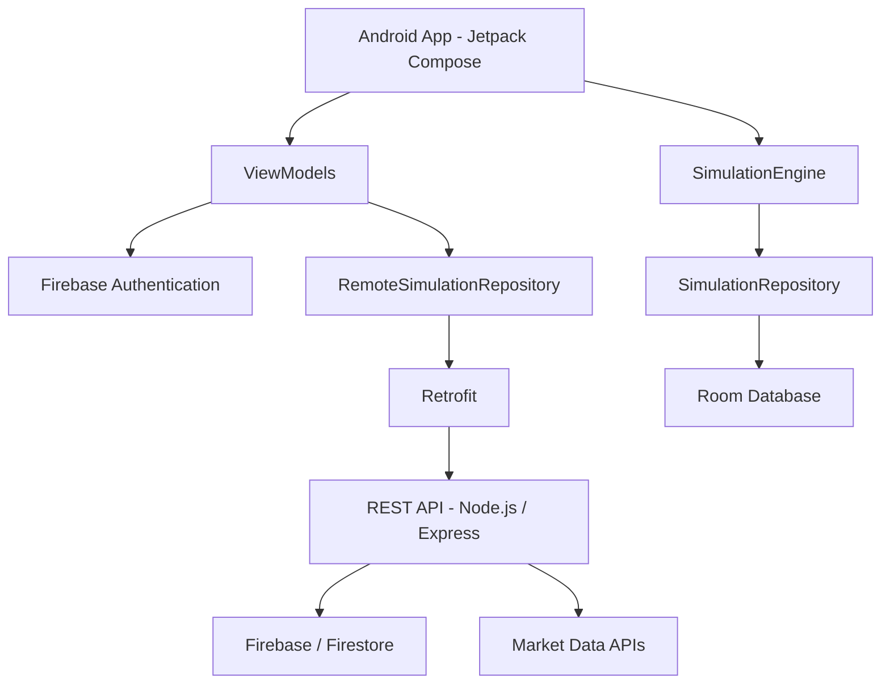
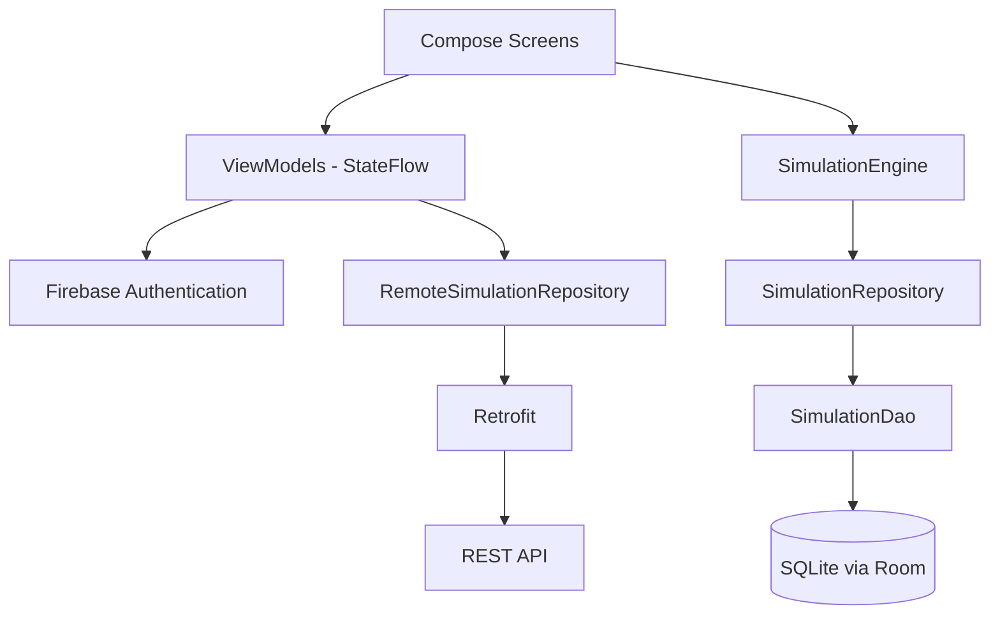
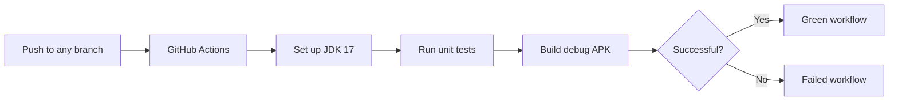

What-If Portfolio Simulator
Android application for PROG7314 / OPSC7312 Part 2. The app is a portfolio “what-if” simulator that shows how an investment can grow over time in both nominal terms and real terms after inflation (CPI).
Overview
A signed-in user can enter a starting investment, monthly contribution, expected annual return, expected annual inflation rate, and investment period. The app then produces a year-by-year projection of the portfolio.
The results show both:
Nominal value – the projected account balance.
Real value – the projected value after accounting for inflation.
The purpose is to show how inflation can reduce the purchasing power of future investment growth. The application is an educational/simulation tool and is not a licensed financial-advice service.
Features
Feature	Status	Description
Google Sign-In	Implemented	Uses Android Credential Manager and Firebase Authentication.
Dashboard	Implemented	Displays the signed-in user's recent simulations using the cloud API.
Settings	Implemented	Allows the user to change display currency and the dark-theme setting. Preferences are stored locally with DataStore, with currency also mirrored to Firestore.
Simulation Builder	Implemented	Accepts investment inputs and produces a nominal-vs-real projection.
Simulation Engine	Implemented	Calculates monthly portfolio growth and inflation-adjusted values.
Nominal vs. Real Chart	Implemented	`PortfolioCanvasChart` displays the nominal and real projection as two lines.
Saved Simulations	Implemented	Room stores simulations locally and `SavedSimulationsScreen` can display and delete them.
REST API / Backend	Implemented	Node.js/Express API hosted on Vercel provides cloud simulation and asset-related services.
Navigation	Partially implemented	The navigation graph is present, but some destinations are not yet connected to the application's entry point.
Biometric authentication, push notifications and multi-language support	Not implemented	These features are outside the current Part 2 scope.
The main custom features developed for Part 2 are the Simulation Builder, nominal-vs-real Canvas chart, and local saved simulations using Room.
Technologies Used
Technology	Purpose
Kotlin 2.0.21	Application language
Jetpack Compose (BOM 2024.09.00)	User interface
Android Gradle Plugin 8.7.3	Android build tooling
Gradle 8.9	Build system wrapper
JDK 17	Java runtime/build environment
Firebase Authentication	Google Sign-In authentication
Cloud Firestore	Cloud user/profile data and backend storage
Android Credential Manager + `googleid`	Google ID token retrieval
Jetpack DataStore	Local settings/preferences persistence
Room 2.6.1 + KSP	Local simulation storage
Navigation Compose 2.8.1	Screen navigation
Retrofit	Communication with the REST API
JUnit 4.13.2	Unit testing
MockK 1.13.13	Mocking dependencies in unit tests
kotlinx-coroutines-test	Testing coroutine/ViewModel code
GitHub Actions	Continuous integration for automated tests and builds
Node.js / Express	REST API backend
Vercel	REST API hosting
System Architecture

The application uses Firebase Authentication for sign-in. Simulation-related cloud operations use the REST API, while local saved simulations are stored on the device using Room.
Android Application Architecture

The main screens use ViewModels to manage UI state. The dashboard communicates with the cloud API through `RemoteSimulationRepository` and Retrofit. The calculation engine is kept separate from Android and network code so that its calculations can be tested on the JVM.
REST API / Backend
The project includes a custom REST API built with Node.js/Express and deployed to Vercel.
The API provides services for authentication verification, CPI data, asset searching, historical price data, and saved simulations.
API Endpoints
Method	Endpoint	Authentication	Description
GET	`/v1/health`	No	Checks whether the API is running.
GET	`/v1/whoami`	Yes	Verifies the caller's Firebase ID token.
GET	`/v1/cpi`	No	Returns South African CPI data.
GET	`/v1/assets/search`	No	Searches available stock and/or cryptocurrency assets.
GET	`/v1/assets/:symbol/history`	No	Returns historical price data for an asset.
POST	`/v1/simulations`	Yes	Runs a historical simulation using asset prices and CPI data.
GET	`/v1/simulations`	Yes	Lists simulations belonging to the signed-in user.
GET	`/v1/simulations/:id`	Yes	Retrieves one saved simulation.
PUT	`/v1/simulations/:id`	Yes	Updates a saved simulation.
DELETE	`/v1/simulations/:id`	Yes	Deletes a saved simulation.
The Android application communicates with the API using Retrofit. Protected API requests require a valid Firebase ID token.
Backend Notes
The backend is hosted on Vercel rather than Firebase Functions. This uses the same Firebase Authentication and Firestore services while avoiding the requirement for the Firebase Blaze plan for the team's deployment.
The API's `createSimulation` feature performs a historical backtest using recorded market prices and CPI data. This is different from the Android application's main forward projection, which uses user-provided expected return and inflation rates.
Authentication
Google Sign-In uses Android Credential Manager to obtain a Google ID token. `SignInViewModel` then uses the credential to create a Firebase Authentication session.
`SignInViewModel` exposes a `SignInUiState` containing states such as `Idle`, `Loading`, `Error`, and `Success`. Keeping the sign-in logic in the ViewModel makes the main logic easier to test without requiring an emulator for the unit tests.
Settings and Preferences
The Settings screen provides:
Display currency selection.
Dark-theme toggle.
Settings are stored locally using Jetpack DataStore through `UserPreferencesRepository`. The selected currency is also mirrored to the user's Firestore profile as a cloud copy.
Simulation Engine
`SimulationEngine.calculateSimulation()` in `data/engine/SimulationEngine.kt` accepts:
Initial investment.
Monthly contribution.
Annual return rate.
Annual inflation rate.
Investment period in years.
The portfolio is compounded monthly. The monthly return is calculated from the annual return rate, and the monthly contribution is included during the simulation.
At the end of each year, the real value is calculated by adjusting the nominal balance for inflation:
```text
real value = nominal value / (1 + annual inflation rate)^year
```
The engine also tracks total contributions and the interest earned. A `SimulationPoint` is created for year 0 through to the final year so the complete projection can be displayed in the chart.
Local Data Storage
Saved simulations are stored locally using Room.
`SavedSimulationEntity` stores the simulation inputs and calculated final values. `SimulationDao` provides database operations, while `SimulationRepository` provides a small layer between the Room database and the Compose screens.
Local saved simulations are stored on the device and are not currently synchronised with Room across multiple devices.
Testing
Unit tests are located under:
```text
app/src/test/java/com/reztek/whatifportfolio/
```
The current tests cover the main calculation and ViewModel logic assigned to automated testing.
SimulationEngineTest
Tests the calculation engine, including:
Zero-growth scenarios.
Zero-year simulations.
Contribution-only growth.
Inflation adjustment.
Monotonic portfolio growth.
Expected values are calculated independently from the implementation and compared using a small floating-point tolerance.
SignInViewModelTest
Uses MockK to test the sign-in ViewModel, including:
Initial state.
Successful sign-in.
Failed sign-in with and without an error message.
Cancellation.
Error dismissal.
DashboardViewModelTest
Tests the dashboard ViewModel at the repository/API boundary, including:
Signed-out state.
Mapping returned simulation data into dashboard state.
Missing or invalid fields.
Empty results.
Repository/API failure handling.
Retry behaviour.
MainDispatcherRule
`MainDispatcherRule` replaces the main coroutine dispatcher during unit tests so that `viewModelScope` code can run in a normal JVM test environment.
`SettingsViewModel` is not currently covered by JVM unit tests because it extends `AndroidViewModel` and constructs its DataStore-backed repository using a real Android `Context`. Testing it with the current design would require Robolectric or dependency injection changes.
GitHub Actions / Continuous Integration

The workflow is stored in:
```text
.github/workflows/android.yml
```
It runs on every push to the repository and on pull requests targeting `main`.
The workflow:
Checks out the repository.
Sets up JDK 17.
Makes the Gradle wrapper executable.
Runs `./gradlew :app:testDebugUnitTest`.
Builds the debug APK using `./gradlew :app:assembleDebug`.
Uploads the unit-test report as a workflow artifact.
Uploads the generated debug APK when the workflow succeeds.
A failure in the test or build step causes the workflow to fail rather than being ignored.
Logging
The application uses `android.util.Log` in the main application, activity lifecycle, navigation, and ViewModels.
Logging is used for events such as:
Application and activity lifecycle events.
Navigation events.
Sign-in attempts and failures.
Data loading and repository failures.
These logs can be viewed through `adb logcat` during a physical-device demonstration.
Installation and Setup
Requirements
Android Studio with support for AGP 8.7.3 and Kotlin 2.0.21.
JDK 17.
Android SDK Platform 34.
A physical Android device for testing Google Sign-In.
Git.
Setup
Clone the repository and open it in Android Studio.
Allow Gradle to sync using the project's Gradle wrapper.
Add a Firebase `google-services.json` file to the `app/` directory for the Firebase project being used locally.
Enable Authentication → Google and Cloud Firestore in that Firebase project.
In `MainActivity.kt`, set the `webClientId` to the Web client OAuth ID associated with the Firebase project.
Connect a physical Android device and run the application.
The Firebase configuration file required for local authentication should be configured for the developer's own Firebase project rather than relying on a placeholder configuration.
Running the Application
From Android Studio, run the `app` configuration.
Alternatively:
```bash
./gradlew :app:installDebug
```
Running Unit Tests
```bash
./gradlew :app:testDebugUnitTest
```
Building the Debug APK
```bash
./gradlew :app:assembleDebug
```
Project Structure
```text
app/src/main/java/com/reztek/whatifportfolio/
├── data/
│   ├── engine/          Simulation calculation logic
│   ├── local/           Room entities, DAO and repository
│   ├── model/           Simulation data models
│   ├── preferences/     DataStore-backed settings
│   └── remote/          Retrofit/API services and remote repository
├── navigation/          Navigation destinations and navigation graph
├── ui/
│   ├── auth/            Sign-in screen and ViewModel
│   ├── dashboard/       Dashboard screen and ViewModel
│   ├── settings/        Settings screen and ViewModel
│   ├── simulation/      Simulation Builder and Saved Simulations
│   ├── chart/           PortfolioCanvasChart
│   └── theme/            Compose theme
├── MainActivity.kt
└── WhatIfApplication.kt

app/src/test/java/com/reztek/whatifportfolio/
├── MainDispatcherRule.kt
├── data/engine/SimulationEngineTest.kt
├── ui/auth/SignInViewModelTest.kt
└── ui/dashboard/DashboardViewModelTest.kt
```
Demonstration Video
The Part 2 demonstration video shows the application running on a physical Android device, including the main functionality required for the project.
YouTube:
AI Usage
Generative AI was used as a support tool during the development of this project. It was mainly used to assist with Git and GitHub commands when pushing and managing code in the repository, and with formatting and organising the `README.md` file to keep the documentation consistent and uniform.
The project implementation was developed and reviewed by the group members. AI suggestions were checked and adapted before being used.
AI was not used to generate the application's features, UI screens, simulation engine logic, or other teammates' production code.
Team Contributions
Team Member	Main Responsibility
Person 1	Core Android UI and Navigation – Sign-In, Dashboard, Settings, navigation graph and local preferences.
Person 2	Custom Cloud REST API and Backend Integration – Node.js/Express API, deployment and Android network integration.
Person 3	Core Simulation Engine and Custom Features – calculation engine, chart and saved simulations.
Person 4	DevOps, Automated Testing, Documentation and Video – GitHub Actions, unit testing, README and demonstration video.
Known Limitations
The navigation graph is implemented, but the current application entry point still needs to use the navigation graph as the main route instead of opening the Simulation Builder directly.
`SavedSimulationsScreen` is implemented but is not fully connected to the navigation flow.
There are currently separate `SimulationResult` / `SimulationPoint` definitions in the engine and model packages. These could be consolidated in a future update.
`SettingsViewModel` is not covered by the current JVM unit-test suite because of its direct Android `Context` dependency.
Local Room simulations are not currently synchronised across devices.
References
Google (2026). Credential Manager — Android Developers.
Google (2026). Jetpack DataStore Preferences — Android Developers.
Google (2026). Navigation with Compose — Android Developers.
Google (2026). Jetpack Compose state.
Firebase (2026). Authenticate Using Google Sign-In on Android.
Firebase (2026). Firebase Admin SDK — Verify ID Tokens.
Firebase (2026). Cloud Firestore Security Rules.
Alpha Vantage (2026). Stock Time Series APIs.
CoinGecko (2026). CoinGecko API Documentation.
Vercel (2026). Deploying Node.js Serverless Functions.
Square (2026). Retrofit — A Type-Safe HTTP Client for Android.
